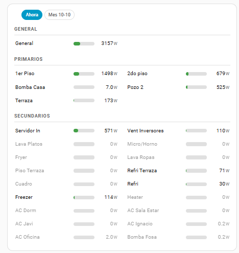
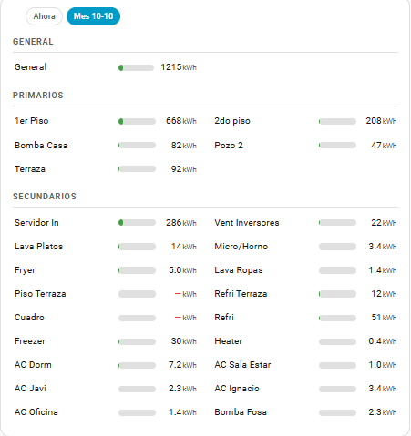

# Power Bars Card

Muchos sensores numéricos como barras horizontales compactas, en el espacio que
ocupaban tres gauges.

*[Read in English](README.md)*



Nació de la vista **Datos Casa**: 24 gauges de potencia repartidos en 8 filas de
3, de los cuales 18 marcaban 0 W en cualquier momento dado. Ocupaban ~1000 px de
alto para no decir casi nada, y había que bajar la ventana para ver el final.
Con este card lo mismo entra en ~300 px.

No es un card publicado — vive local, en `/local/power-bars-card/`.

## Instalación

Ya está instalado. El archivo está en `/homeassistant/www/power-bars-card/` y el
recurso registrado como:

```
/local/power-bars-card/power-bars-card.js?v=1.2.0
```

**Si se edita el `.js` hay que subir el `?v=`**, o el navegador sigue sirviendo
la copia vieja de la caché. El recurso se cambia en Configuración → Dashboards →
menú de los tres puntos → Recursos.

## Uso mínimo

```yaml
type: custom:power-bars-card
title: Consumos
entities:
  - sensor.casa_ts_consumo_potencia
  - sensor.1er_piso_potencia
  - sensor.terraza_potencia
```

## Opciones

| Opción | Por defecto | Qué hace |
|---|---|---|
| `title` | — | Texto del encabezado |
| `entities` | — | Lista plana de entidades |
| `groups` | — | Lista de `{name, max, entities}` (ver abajo) |
| `sort` | `value` | `active`, `value`, `config` o `name` (ver abajo) |
| `columns` | `1` | `1` o `2`. En pantallas bajo 600 px siempre cae a 1 |
| `hide_zero` | `false` | Esconde los que están bajo el umbral |
| `zero_threshold` | `1` | Bajo cuánto se considera "apagado" (se pinta gris) |
| `show_total` | `true` | Muestra el total arriba a la derecha |
| `total` | `sum` | Entity_id del medidor que da el total. Sin esto, suma las filas |
| `max` | automática | Escala de las barras. Sin esto usa el mayor valor presente |
| `severity` | `{yellow: 0.5, red: 0.8}` | Umbrales de color (ver abajo) |
| `name_width` | `8.5em` | Ancho de la columna de nombres |

### Por entidad

En vez de un string, un objeto:

```yaml
entities:
  - entity: sensor.fryer_power
    name: Freidora                        # pisa el friendly_name
    max: 2200                             # escala propia, solo para esta barra
    color: "#8e44ad"                      # color fijo, ignora la severidad
    severity: {yellow: 1000, red: 1800}   # umbrales propios
    zero_threshold: 10                    # cuando esta fila se pinta gris
```

## Umbrales

Hay dos, y los dos se pueden fijar en tres niveles: **entidad → grupo →
tarjeta**. Gana el más específico.

### `zero_threshold` — el gris

Bajo ese valor la fila se pinta gris (apagado). En Datos Casa está en 5 W, que
deja fuera los standby de los enchufes.

```yaml
zero_threshold: 5                 # para toda la tarjeta
groups:
  - name: Primarios
    zero_threshold: 20            # este grupo usa 20
    entities:
      - entity: sensor.refri_casa_potencia_2
        zero_threshold: 2         # y este enchufe, 2
```

### `severity` — los colores

Se pueden escribir de dos maneras, y la tarjeta las distingue sola:

| Cómo se escribe | Cómo se lee |
|---|---|
| `{yellow: 0.5, red: 0.8}` | **Fracción** del máximo de esa barra |
| `{yellow: 1000, red: 1800}` | **Watts** absolutos |

La regla: **un valor ≤ 1 es fracción, > 1 son watts**. No hay opción que
elegir. Nadie define un umbral real de 0,8 W, así que no hay ambigüedad en la
práctica.

```yaml
severity: {yellow: 0.5, red: 0.8}         # toda la tarjeta, en fracción
groups:
  - name: Secundarios
    severity: {yellow: 800, red: 1500}    # este grupo, en watts
    entities:
      - entity: sensor.fryer_power
        severity: {yellow: 1200, red: 2000}   # y esta freidora, la suya
```

## El total y los circuitos anidados

Por defecto el total es la **suma de las filas**. Eso solo es correcto si los
circuitos son independientes. En esta casa la rama es:

```
General  ──>  Primarios  ──>  Secundarios
```

o sea que General ya incluye a todos los demas: sumarlos cuenta la misma energia
dos y tres veces. Por eso la tarjeta de Datos Casa apunta el total al medidor de
arriba:

```yaml
total: sensor.casa_ts_consumo_potencia
```

Tambien se puede dejar la suma pero sacar un grupo de ella, con `in_total` en el
grupo:

```yaml
groups:
  - name: Primarios
    entities: [...]
  - name: Secundarios
    in_total: false      # cuelgan de los primarios, no se suman aparte
    entities: [...]
```

El medidor del total **no tiene que estar entre las filas**: puede ser una
entidad que no se muestra.

### Grupos

Cada grupo lleva su propio encabezado y **su propia escala**, que es lo que
permite mezclar un tablero general de 9900 W con enchufes de 8 W sin que estos
últimos queden invisibles:

```yaml
type: custom:power-bars-card
title: Consumos
sort: config
columns: 2
groups:
  - name: Primarios
    max: 9900
    entities: [sensor.casa_ts_consumo_potencia, sensor.1er_piso_potencia]
  - name: Secundarios
    max: 2500
    entities: [sensor.fryer_power, sensor.micro_horno_power]
```

## Modos — las mismas filas, leídas de otra forma

Un modo pone un botón en la cabecera. Cada modo resuelve cada fila a **otra
entidad**, así la misma tarjeta muestra watts ahora o kWh de un período.

```yaml
billing_day: 10                  # el ciclo de facturación empieza el 10
modes:
  - name: Ahora                  # sin regla: lee la entidad tal cual
  - name: Mes 10-10
    period: billing              # suma el ciclo de facturación vigente
    key: energy                  # la clave `energy:` de cada fila
    unit: kWh
    max: auto
    total: sensor.casa_ts_consumo_resumen_entregado
entities:
  - entity: sensor.fryer_power
    energy: sensor.fryer_energy
```

De dónde saca la entidad: `key` (escrita a mano en la fila) gana a
`replace: ["_power", "_energy"]` (derivada del nombre). **Si el modo tiene regla
y una fila no la cumple, esa fila sale como no disponible — no cae de vuelta a
la entidad base.** Caer de vuelta metería watts en una columna de kWh sin que se
note, que es peor que un hueco visible. El tooltip dice qué entidad falta.

La misma tarjeta en el modo del ciclo de facturación — mismas filas, mismo
orden, kWh en vez de watts:



Las dos filas con `—` son los enchufes que no tienen sensor de energía. Es a
propósito: un hueco visible es mejor que colar sus watts en una columna de kWh.

`period` puede ser `today`, `month` (mes calendario) o `billing` (desde el
último `billing_day`). Un modo con `period` **no lee el estado**: suma
estadísticas de largo plazo sobre la ventana, la misma fuente que usa el panel
de Energía. Por eso funciona desde el primer día, sin crear un `utility_meter`
por enchufe ni esperar a que acumule.

`max`, `unit`, `severity` y `zero_threshold` puestos en un modo **le ganan a la
tarjeta, al grupo y a la entidad**: cambió la magnitud, y una escala de 9900 W
no significa nada en kWh.

**Las unidades se convierten solas.** Si el modo declara `kWh` y la entidad
reporta `Wh`, se convierte. En esta casa hay dos enchufes así: Aire Ignacio
marca 3375 Wh en el ciclo, y sin convertir aparecería como el mayor consumo de
la casa, por encima del 1er Piso.

## Editor de UI

Todo se puede configurar sin tocar YAML, incluidos los grupos:

- **Use groups** convierte una tarjeta plana; las entidades que ya tenías pasan
  al primer grupo sin perderse
- **+ Add group**, y por grupo: subir ▲, bajar ▼, borrar ✕
- Cada grupo edita nombre, escala máxima, umbral de apagado, "sumar al total" y
  sus entidades
- **+ Add mode** hace lo mismo con los modos: nombre, período, regla de
  derivación, unidad y escala
- Con `sort: config` o `sort: active` aparece una lista numerada con ▲▼ al lado
  de cada entidad. El selector de HA no deja reordenar, así que sin esto habría
  que borrar todo y volver a agregarlo en orden
- Los nombres a mano y la `severity` puesta en YAML sobreviven a guardar desde
  la UI

La interfaz está en inglés porque la tarjeta es pública; este README es la
versión en castellano.

## Decisiones que parecen raras y no lo son

**La escala se calcula sobre el grupo entero, no sobre lo visible.** Con
`hide_zero` activo, esconder los apagados no reescala las barras. Hoy da lo
mismo — `hide_zero` solo saca valores chicos y el máximo nunca es uno de ellos —
pero es la forma que no se rompe si mañana se filtra por otra cosa.

**Sirve para cualquier sensor numérico**, no solo potencia: presión de agua,
uso de disco, humedad, señal. El nombre es por la forma de la salida, no por la
entrada.

**`sort: active` en vez de `value`.** Con `value` la lista se rebaraja entera
cada vez que cambia cualquier consumo, aunque nada se haya prendido. Con
`active` los encendidos suben (ordenados entre ellos por consumo) y **los
apagados se quedan quietos en el orden escrito**: solo se mueve lo que cambia
de estado. El orden es por grupo, no global.

**Los colores son fracción del máximo, no watts.** Con `max: 9900` y los
umbrales por defecto, amarillo empieza en 4950 W y rojo en 7920 W — casi lo
mismo que los `severity: {yellow: 5000, red: 8000}` que tenían los gauges
originales.

**`max` acepta un número o la palabra `auto`.** En un *modo*, dejarlo en blanco
significa "usa lo que diga el grupo" y `auto` significa "ajusta a la fila mayor".
En un modo que cambia la magnitud casi siempre quieres `auto`: una escala en
watts no dice nada en kWh.

**Si `max` es automático, el mayor siempre queda rojo.** Es esperable: está al
100% de la escala. Para que los colores signifiquen algo hay que fijar un `max`,
o escribir la `severity` en watts, que no depende de la escala.

## Tests

```bash
node test/smoke.js
```

390 comprobaciones, sin dependencias: hay un shim de DOM mínimo dentro del
propio test. A diferencia del otro card de la casa, aquí **se llama a
`_render()` y `_update()` de verdad** y se revisa el HTML que producen, en vez
de simular lo que harían.

Los tests se validan rompiendo el card a propósito y comprobando que fallen.
Dos hallazgos de ese ejercicio que vale la pena dejar escritos:

- **Los tests de color estaban mal.** Buscaban `--pbc-yellow` con un
  `includes()` sobre todo el HTML, y ese texto ya aparece en el bloque
  `<style>` donde se definen las variables. Siempre daban verdadero. Ahora se
  lee el atributo `style` de cada barra (`fills()`).
- **El orden `active` necesitó buscar el caso a la fuerza.** Quitar la línea
  que separa encendidos de apagados no cambiaba el resultado en ninguno de los
  tests: en todos ellos lo encendido valía más que lo apagado, y el comparador
  roto acertaba por casualidad. Una búsqueda aleatoria sobre 200.000 listas
  encontró que difieren en el 0,18% de los casos, y el patrón es una fila
  **encendida con valor bajo** — algo que solo existe desde que hay umbral por
  entidad. Ese caso concreto es el test 38a.

Sigue habiendo una rotura que **ningún test detecta**: calcular la escala sobre
las filas visibles en vez de sobre el grupo entero. Es indistinguible hoy, por
la razón explicada más arriba, y está anotado en el test 14 para que nadie lo
lea como una garantía que no da.
